##Tarea DNS

-**Comandos Utilizados** :

Siguiendo el video:

- sudo apt-get install bind9 -> Instalamos bind9 

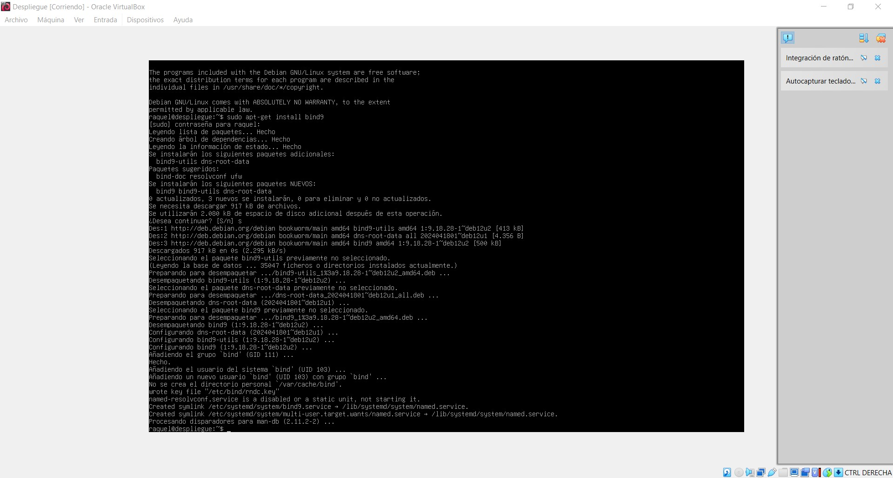

- sudo mkdir /etc/bind/zones -> Crear directorio

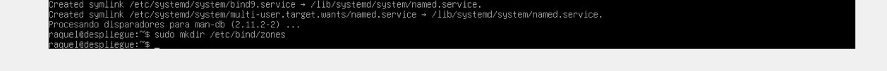

- sudo systemctl status bind9 -> Comprobar que está bien creado.
- sudo cd /etc/bind -> Ir al directorio
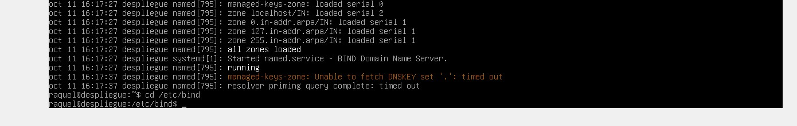

- sudo apt-get install tree 
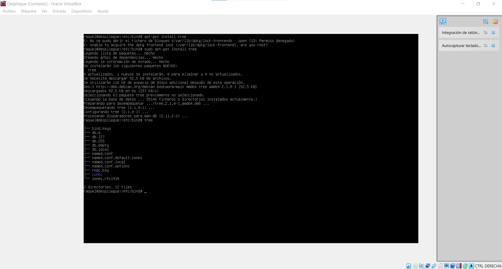

-  tree
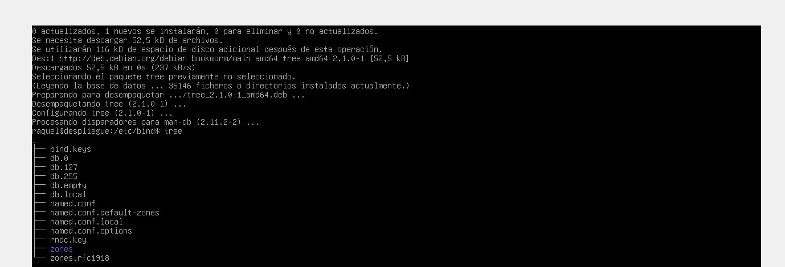

- sudo cp db.local /etc/bind/zones/prueba.com.zone
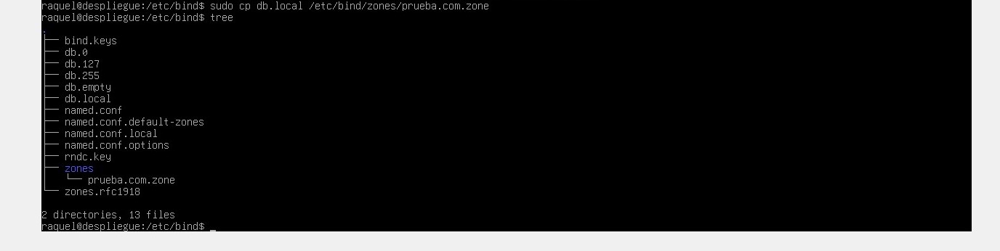

- sudo nano /etc/bind/named.conf.local 
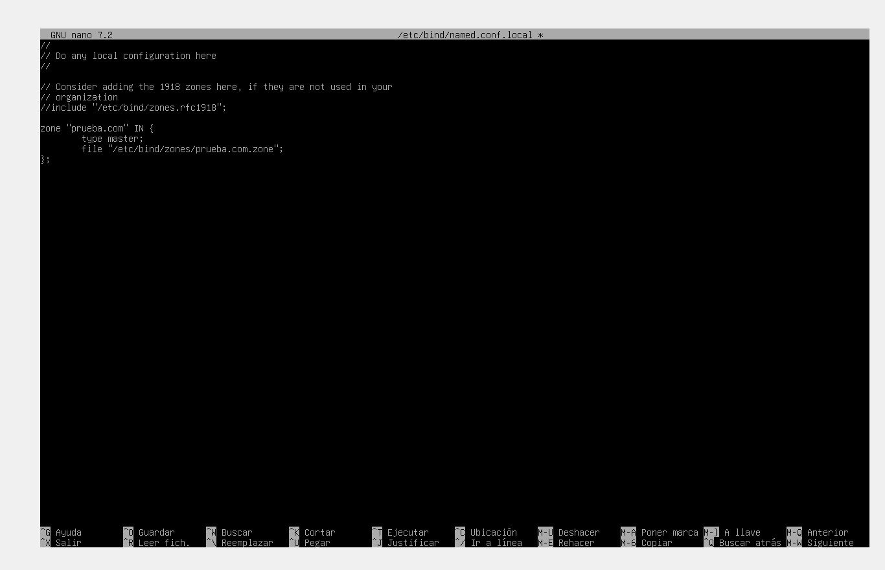

- sudo nano /etc/bind/zones/prueba.com.zone
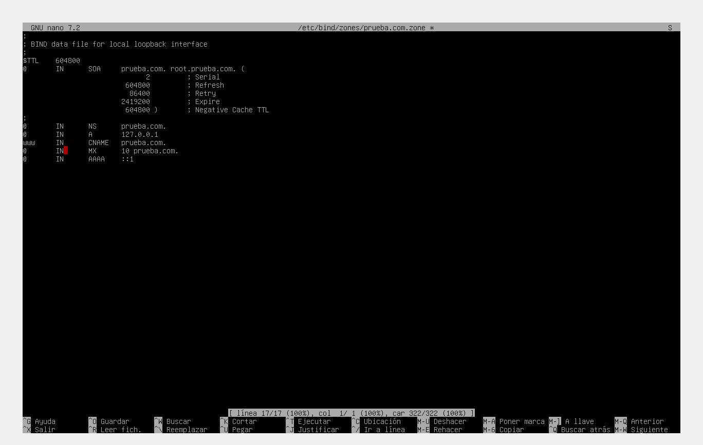

- sudo systemctl restart bind9
- dig @localhost prueba.com
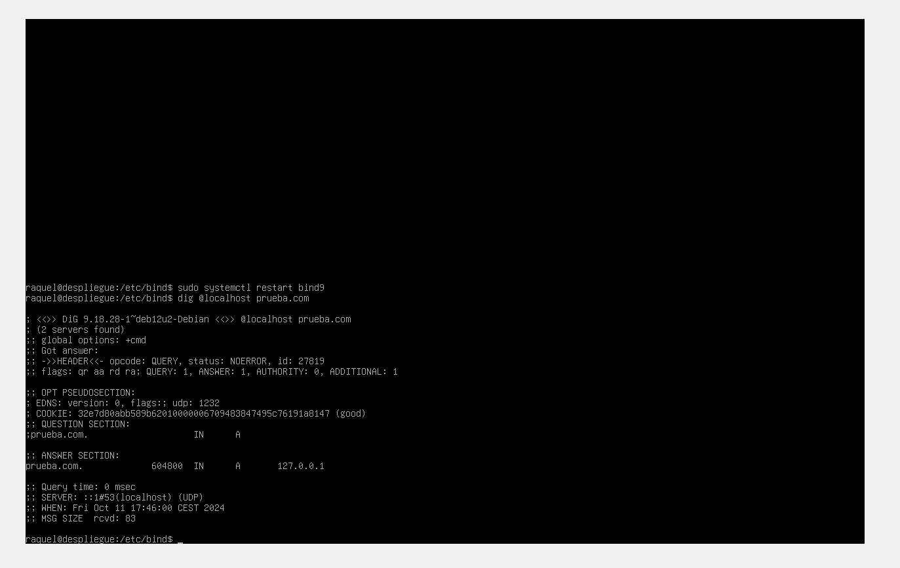

Ahora siguiendo los apuntes:

- sudo nano /etc/bind/named.conf.options

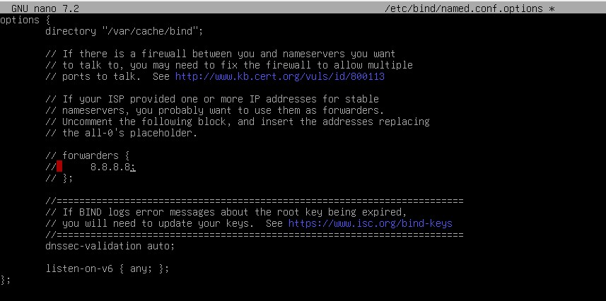

- sudo nano /etc/bind/named.conf.local
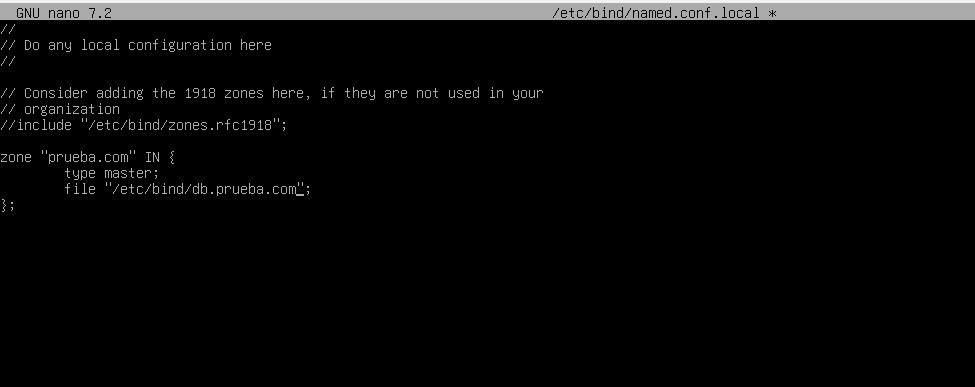

- sudo cp /etc/bind/db.local /etc/bind/db.prueba.com
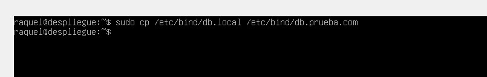

- sudo nano /etc/bind/db.prueba.com

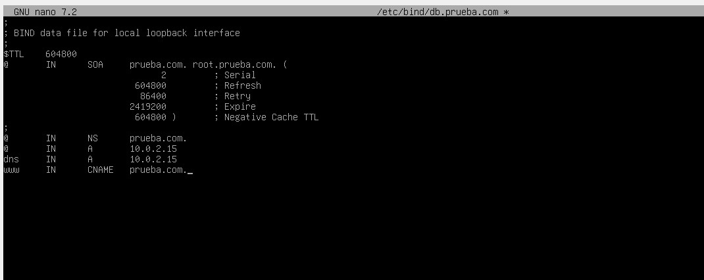

- sudo nano /etc/resolv.conf
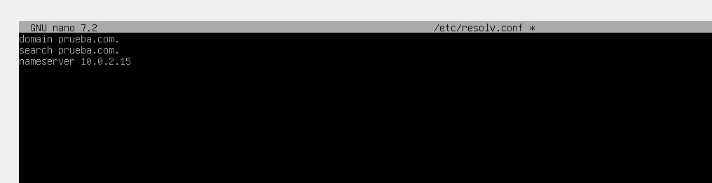

- sudo systemctl restart bind9
- dig @localhost prueba.com
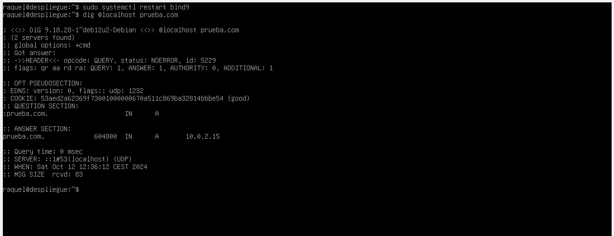

- nslookup prueba.com localhost
- nslookup prueba.com 10.0.2.15
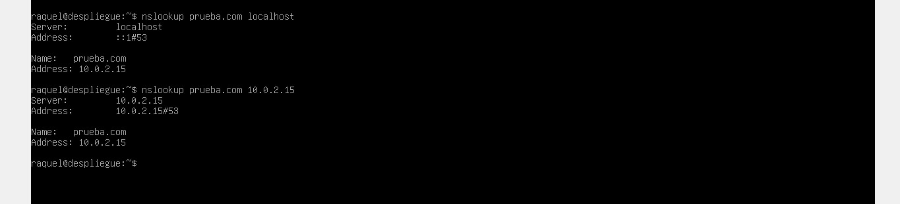

Ahora siguiendo los apuntes:

- sudo nano /etc/bind/named.conf.options

- sudo nano /etc/bind/named.conf.local

- sudo cp /etc/bind/db.local /etc/bind/db.prueba.com

- sudo nano /etc/bind/db.prueba.com

- sudo nano /etc/resolv.conf

- sudo systemctl restart bind9
- dig @localhost prueba.com

- nslookup prueba.com localhost
- nslookup prueba.com 10.0.2.15
