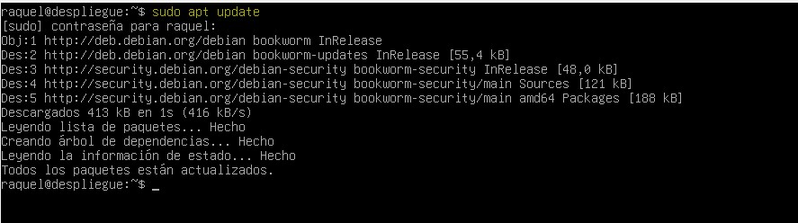
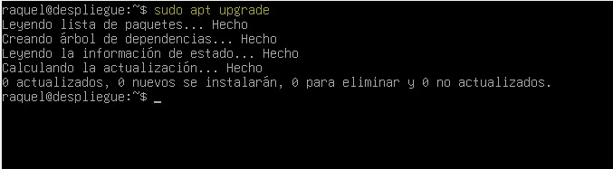
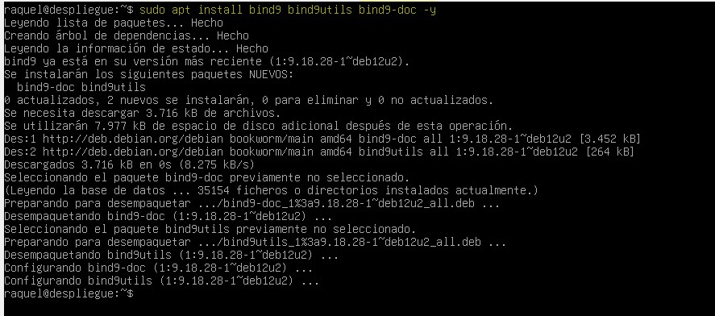
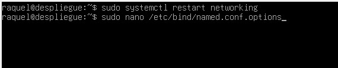
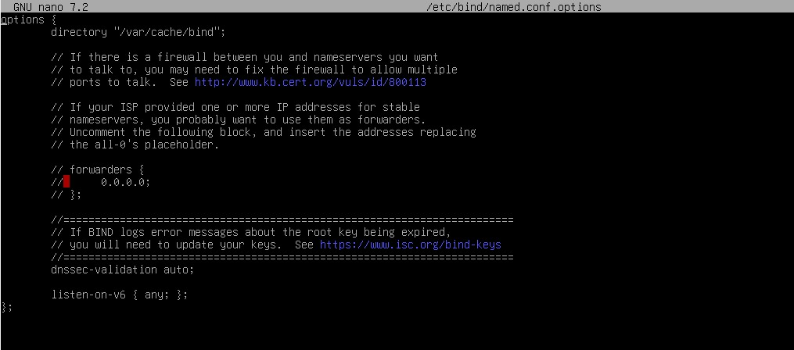

## TAREA DNS SERVER ##

-**Comandos Utilizados** :

Comando: sudo apt update

Comando: sudo apt upgrade

Comando: sudo apt install bind9 bind9utils bind9-doc -y

Comando: sudo systemctl restart networking
       : sudo nano /etc/bind/named.conf.options 

Sin modificar:

Modificada:

