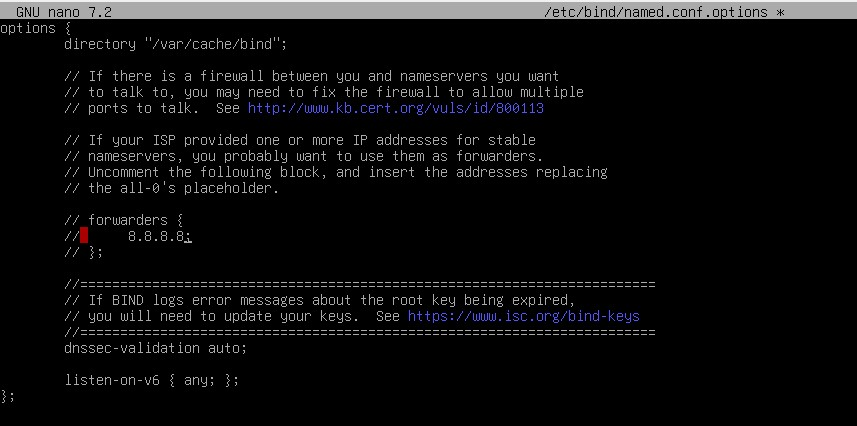

## TAREA DNS SERVER ##

## Comandos Utilizados

-**Comando:** sudo apt update

-**Comando:** sudo apt upgrade

-**Comando:** sudo apt install bind9 bind9utils bind9-doc -y

-**Comando:** sudo systemctl restart networking
-**Comando:** sudo nano /etc/bind/named.conf.options 

-**Sin modificar:**

-**Modificada:**

-**Comando:** sudo nano /etc/bind/named.conf.options

-**Comando:** sudo cp /etc/bind/db.local /etc/bind/db.prueba.com

-**Comando:** sudo nano /etc/bind/db.prueba.com

-**Sin modificar:** cambiamos localhost por prueba.com.

-**Modificada:** lo guardamos y salimos.

-**Comando:** sudo nano /etc/resolv.conf

-**Sin modificar:** cambiamos el nameserver 10.0.2.3 por 10.0.2.15

-**Modificada:** guardamos y salimos.

-**Comando:** sudo systemctl restart bind9
-**Comando:** sudo systemctl status bind9

-**Comando:** nslookup prueba.com

-**Comando:** dig @localhost prueba.com
-**Comando:** dig @localhost www.prueba.com

