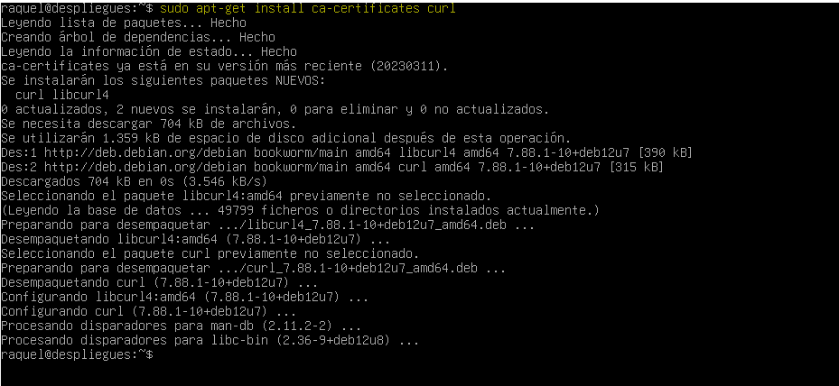

## INSTALCION DE DOCKER ##

-**COMANDOS UTILIZADOS**

- sudo apt-get update

- sudo apt-get install ca-certificates curl

- sudo install -m 0755 -d /etc/apt/keyrings
- sudo curl -fsSL https://download.docker.com/linux/debian/gpg -o /etc/apt/keyrings/docker.asc
- sudo chmod a+r /etc/apt/keyrings/docker.asc

Lo hago en cmd del oredandor:

- sudo curl -fsSL https://download.docker.com/linux/debian/gpg -o /etc/apt/keyrings/docker.asc

- sudo chmod a+r /etc/apt/keyrings/docker.asc

echo \
  "deb [arch=$(dpkg --print-architecture) signed-by=/etc/apt/keyrings/docker.asc] https://download.docker.com/linux/debian \
  $(. /etc/os-release && echo "$VERSION_CODENAME") stable" | \
  sudo tee /etc/apt/sources.list.d/docker.list > /dev/null

- sudo apt-get update

- (. /etc/os-release && echo "$VERSION_CODENAME")

- sudo apt-get install docker-ce docker-ce-cli containerd.io docker-buildx-plugin docker-compose-plugin

- sudo docker run hello-world
